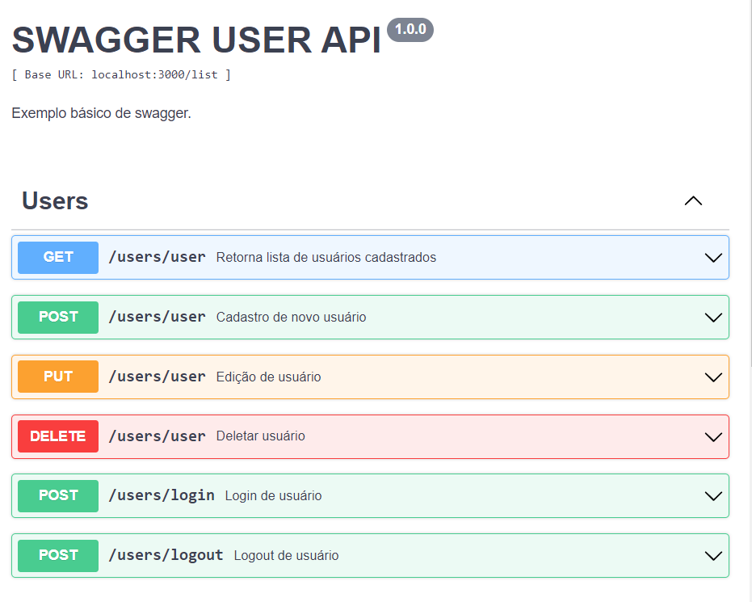

# Swagger

[Swagger](https://swagger.io/) é um framework composto por diversas ferramentas que, independente da linguagem, auxilia a descrição, consumo e visualização de serviços de uma API REST.

## Objetivo:

Auxiliar no processo de definir, criar, documentar e consumir a API REST de um projeto específico.

## Tecnologias utilizadas:

- [Swagger](https://swagger.io/): módulo para geração da documentação;

## Visualização:

Para visualizar o swagger basta:

- acessar o [Swagger Editor](https://editor.swagger.io/);
- copiar todo os dados do arquivo `swagger.yml` e colar no [Swagger Editor](https://editor.swagger.io/).

## Swagger Editor:

Ajuda na construção de um documento do Swagger a partir de um navegador da web, fornecendo uma visualização lado a lado do documento do Swagger e as definições resultantes da API REST.

- Caso tudo esteja funcionando, em seu navegador a documentação será apresentada no seguinte formato:

> 
